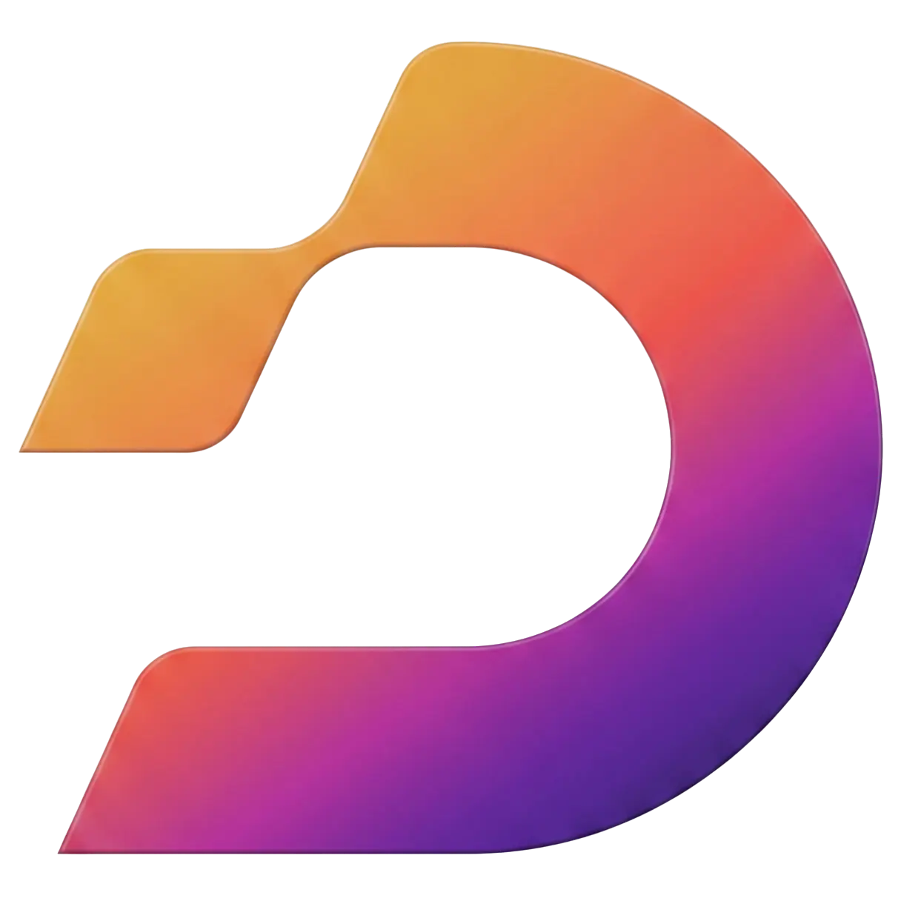

<p align="center">
  
</p>

<h1 align="center">DEVUP AI</h1>

<p align="center">
  <strong>Algeria's #1 AI Infrastructure — Enterprise-Grade Inference Gateway</strong>
</p>

<p align="center">
  <a href="https://devupai.com">Website</a> •
  <a href="https://devupai.com/docs">Documentation</a> •
  <a href="https://devupai.com/dashboard">Dashboard</a> •
  <a href="mailto:support@devupai.com">Support</a>
</p>

<p align="center">
  
  
  
  
</p>

---

## 🚀 What is DEVUP AI?

**DEVUP AI** is a fully managed AI inference gateway built for developers, startups, and enterprises across Algeria and the MENA region. We provide **drop-in OpenAI-compatible APIs** backed by a fleet of 170+ state-of-the-art models — all billed natively in **Algerian Dinar (DZD)**.

Point your existing OpenAI SDK at `api.devupai.com` and you're live. No code changes. No vendor lock-in.

---

## 🔌 Features

| Feature | Description |
| :--- | :--- |
| **170+ Models** | DeepSeek V3, Llama 3.1 405B, Qwen 3, Gemma 2, Mistral, and more |
| **OpenAI-Compatible** | Works with any OpenAI SDK — Python, Node.js, Go, Rust, cURL |
| **Anthropic-Compatible** | Native Claude SDK support via our translation gateway |
| **DZD Billing** | Pay in Algerian Dinar. No international card required |
| **Zero Cold Starts** | Models are always warm. Sub-second time-to-first-token |
| **Scoped API Keys** | Fine-grained access control with model whitelisting and per-key budgets |
| **Real-Time Telemetry** | Usage dashboards, per-request cost tracking, and spending alerts |
| **Enterprise Security** | SOC 2 aligned practices. No data logging. Full request isolation |

---

## ⚡ Quickstart

### Using cURL

```bash
curl https://api.devupai.com/v1/chat/completions \
  -H "Authorization: Bearer dvup_your_key_here" \
  -H "Content-Type: application/json" \
  -d '{
    "model": "deepseek-ai/DeepSeek-V3-0324",
    "messages": [{"role": "user", "content": "Hello from Algeria!"}],
    "max_tokens": 256
  }'
```

### Using the OpenAI Python SDK

```python
from openai import OpenAI

client = OpenAI(
    api_key="dvup_your_key_here",
    base_url="https://api.devupai.com/v1"
)

response = client.chat.completions.create(
    model="deepseek-ai/DeepSeek-V3-0324",
    messages=[{"role": "user", "content": "Explain quantum computing in one paragraph."}]
)

print(response.choices[0].message.content)
```

### Using the OpenAI Node.js SDK

```typescript
import OpenAI from "openai";

const client = new OpenAI({
  apiKey: "dvup_your_key_here",
  baseURL: "https://api.devupai.com/v1",
});

const completion = await client.chat.completions.create({
  model: "deepseek-ai/DeepSeek-V3-0324",
  messages: [{ role: "user", content: "Write a haiku about Algiers." }],
});

console.log(completion.choices[0].message.content);
```

---

## 📦 Repositories

| Repository | Description |
| :--- | :--- |
| [`devupai-node`](https://github.com/devupai-platform/devupai-node) | Official Node.js & TypeScript SDK for DEVUP AI |
| [`devupai-examples`](https://github.com/devupai-platform/devupai-examples) | Production-ready starter kits and integration examples |

---

## 🔗 Links

- 🌐 **Website:** [devupai.com](https://devupai.com)
- 📖 **Documentation:** [devupai.com/docs](https://devupai.com/docs)
- 📊 **Dashboard:** [devupai.com/dashboard](https://devupai.com/dashboard)
- 📧 **Support:** [support@devupai.com](mailto:support@devupai.com)

---

<p align="center">
  <sub>Built with 🇩🇿 in Algeria — Powering the next generation of AI applications.</sub>
</p>

<p align="center">
  
</p>
